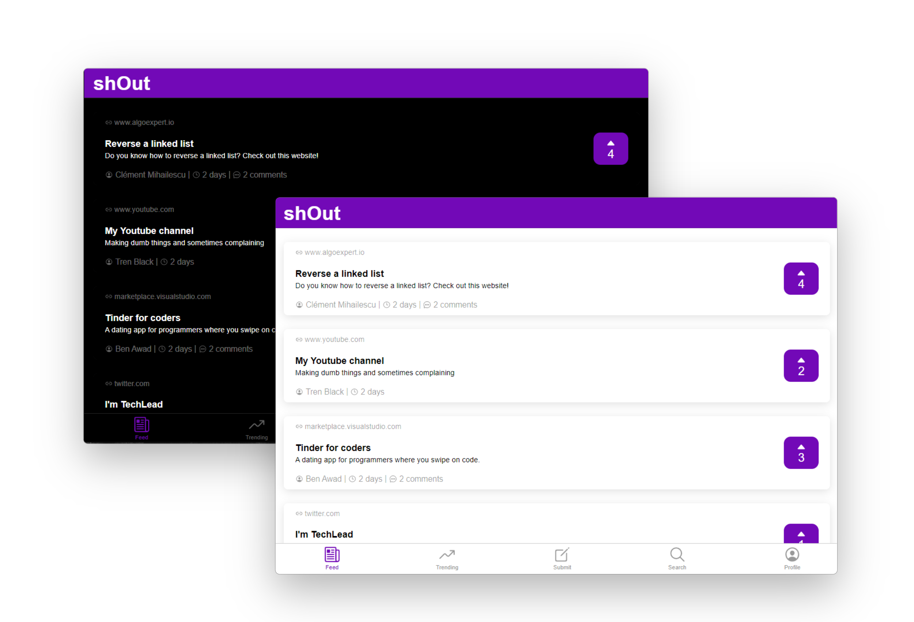

# shOut

 

A hybrid app to *shoutout* interesting/useful links found on the web. Available as a website, web app, desktop app, android native app and an iOS native app.

### Features

- Posts links with upvote/downvote
- Comment to posted links with replies
- Recent and Trending pages
- Search in all posts
- User profiles with edit and recovery options
- Light and Dark themes
- Native Applications with native styling conventions for each platform

### Build With

- [React](https://reactjs.org/)
- [Ionic (w/ Capacitor)](https://ionicframework.com/)
- [Firebase](https://firebase.com/)

## Screenshots

| iOS Light                                 | Android Dark                                    | Android Light                                     | iOS Dark                                |
| ----------------------------------------- | ----------------------------------------------- | ------------------------------------------------- | --------------------------------------- |
|  |  |  |  |
